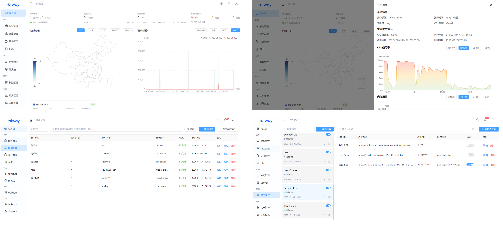

<div align="center">
  


[中文](README.md) | [English](README_en.md)
</div>


**aiway** is a high-performance API + AI gateway developed in Rust, dedicated to providing stable, efficient, and scalable request forwarding and management solutions.

Leveraging Rust's memory safety features and zero-cost abstractions, aiway delivers exceptional security and stability while maintaining high performance.

## Platform Support

- **Linux** (x86_64 / arm64)
- **macOS** (arm64)

## Protocol Support

- HTTP/HTTPS
- SSE
- WebSocket
- MCP

📑 [Documentation](https://aiway.coderbox.cn/doc.html)

## Quick Start

### Option 1: Using Pre-built Binaries

```bash
# Download and extract
curl -L https://github.com/xgpxg/aiway/releases/latest/download/aiway-linux-amd64-standalone.tar.gz | tar -zxvf - -C .

# Start the service
./aiway
```

> **Note**: The pre-built binaries are built against glibc 2.35. If your system's glibc version is lower than 2.35, please build from source.

### Option 2: Building from Source

```bash
# Build Gateway (standalone mode)
cargo build --bin gateway -F standalone

# Build Console (standalone mode)
cargo build --bin console -F standalone

# Build Logg
cargo build --bin logg

# Run
cargo run --bin aiway
```

### Accessing the Services

- **Management Console**: http://127.0.0.1:7000
- **Gateway Entry**: http://127.0.0.1:7001
- **Default Credentials**: `admin` / `admin`

### Build Options

**Gateway Features:**

- `standalone` - Standalone mode
- `cluster` - Cluster mode
- `model-proxy` - Enable model proxy functionality

**Console Features:**

- `standalone` - Standalone mode
- `cluster` - Cluster mode

## Core Features

- **Dynamic Routing** - Flexibly configure request routing rules
- **Service Management** - Unified management of backend service instances
- **Plugin System** - Scalable plugin architecture
- **Security Protection** - Built-in firewall and security verification mechanisms
- **API Key Management** - Unified API key management
- **Log Monitoring** - Complete log storage and real-time monitoring
- **Visual Dashboard** - Intuitive management console
- **AI Model Proxy** - Intelligent AI model proxy and request forwarding
- **MCP Integration** - Model Context Protocol support

## Plugin Ecosystem

### Official Plugins

We provide a series of commonly used plugins. Visit [aiway-plugins](https://github.com/xgpxg/aiway-plugins) for more information.

### Custom Plugins

If you need to develop custom plugins, please refer to the [Plugin Development Documentation](https://aiway.coderbox.cn/doc.html?path=docs/plugins/introduction.md).

## Interface Preview



## Documentation

For detailed documentation, please visit: [https://aiway.coderbox.cn/doc.html](https://aiway.coderbox.cn/doc.html)

## Performance

| Requests | Concurrency | Success Rate | Throughput (req/s) | Avg Latency (ms) | P50 (ms) | P90 (ms) | P95 (ms) | P99 (ms) | P99.9 (ms) | Fastest (ms) | Slowest (ms) | Total Time (ms) |
|---------------|-----|------|-------------|-----------|----------|----------|----------|----------|------------|---------|---------|-----------|
|---------------|-----|------|-------------|-----------|----------|----------|----------|----------|------------|---------|---------|-----------|
| **10,000**    | 300 | 100% | 42,381.22   | 6.89      | 5.00     | 11.95    | 19.27    | 41.22    | 47.52      | 0.47    | 55.69   | 235.95    |
| **100,000**   | 300 | 100% | 61,150.17   | 4.89      | 4.65     | 7.23     | 8.22     | 10.72    | 23.58      | 0.25    | 31.33   | 1,635.32  |
| **1,000,000** | 300 | 100% | 60,574.36   | 4.95      | 4.74     | 7.36     | 8.33     | 10.53    | 13.90      | 0.19    | 28.78   | 16,508.63 |

> Test Environment:
> - Hardware: Ubuntu 24.04, Intel i7-12700K, 16 GB RAM
> - Routes: 10
> - Plugins: 2
> - Test service and gateway on the same machine


## Contributing

Welcome to submit Issues and Pull Requests to help improve aiway!


