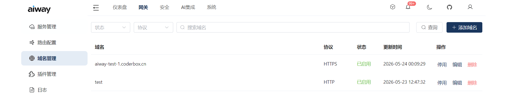

# 接入层

## `access` 接入点

通常情况下，网关作为系统内部服务，不应在公网暴露，所以需要一个接入点来接收外部流量，并转发到网关节点。

接入层 `access` 是 aiway 为网关提供的的可选入口点，在 L4 层进行流量转发，支持 TLS 终止。

```text
# 请求流程
Request --> Access --> Gateway --> Service
```

`access` 会与控制台通信，自动获取可用的网关节点，当有多个网节点时，建议通过 `access` 来接入，可将域名解析到 `access`
节点，实现网关的负载均衡。




> 如果您对 Nginx 更熟悉，也可以使用 Nginx 作为接入点，反向代理到网关节点。

## 启动参数

以下是 `access` 的启动参数：

```shell
access -h
Usage: access [OPTIONS]

Options:
  -a, --address <ADDRESS>        Listen address [default: 0.0.0.0]
  -p, --port <PORT>              HTTP listen port [default: 7080]
      --https-port <HTTPS_PORT>  HTTPS listen port, 0 means disabled [default: 0]
  -c, --console <CONSOLE>        Console address [default: 127.0.0.1:7000]
  -l, --log-server <LOG_SERVER>  Log server address [default: 127.0.0.1:7280]
  -h, --help                     Print help
  -V, --version                  Print version

```