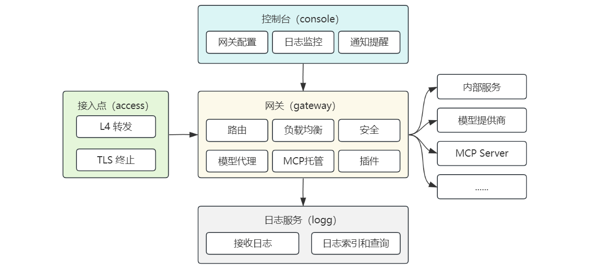

# 架构概览

## 系统架构



## 组件职责

| 组件      | 说明                        |
|---------|---------------------------|
| aiway   | 一体化启动器，内嵌其他组件，适合单机模式部署和运行 |
| gateway | 网关核心，处理请求转发               |
| console | 管理控制台，提供所有配置管理和监控功能       |
| logg    | 日志服务，存储和检索日志              |
| access  | L4 接入层，TCP 透传 + TLS 终止    |

## 请求处理流程

网关的请求处理遵循 Pingora ProxyHttp 生命周期：

```
请求到达 → early_request_filter(预处理/防火墙)
                ↓
         request_filter(路由匹配/鉴权/插件/负载均衡)
                ↓
           upstream_peer(选择后端)
                ↓
         upstream_request_filter(修改请求头)
                ↓
          request_body_filter(修改请求体)
                ↓
           发送请求到后端 → 接收响应
                ↓
         upstream_response_filter(处理响应)
                ↓
       upstream_response_body_filter(修改响应体)
                ↓
              logging(日志记录/清理)
```
