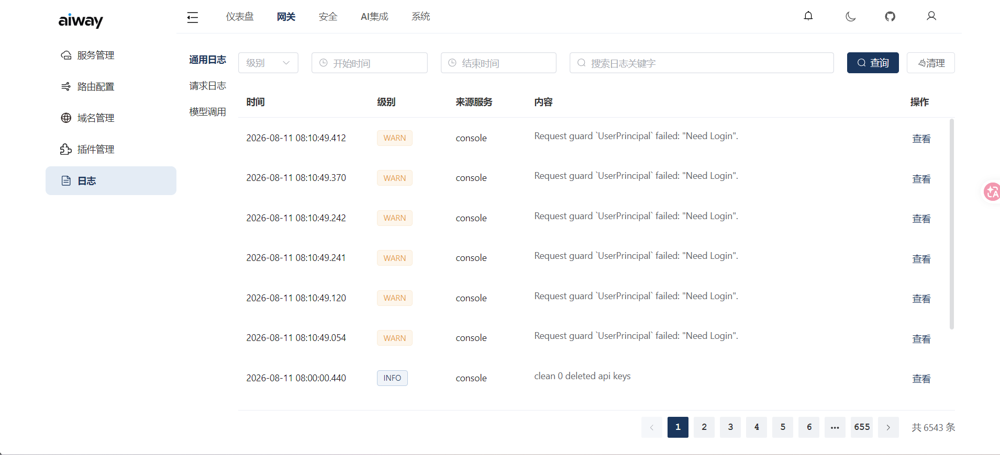

# 日志查询

通过控制台查询网关请求日志和系统日志。

## 请求日志

记录每个 HTTP 请求的详细信息：

| 字段 | 说明 |
|------|------|
| request_id | 唯一请求 ID |
| client_ip | 客户端 IP |
| method | HTTP 方法 |
| path | 请求路径 |
| host | 请求域名 |
| status_code | HTTP 状态码 |
| elapsed | 处理耗时 (ms) |
| response_size | 响应体大小 |
| user_agent | 客户端 UA |
| referer | 请求来源 |
| node_address | 处理节点 |
| region | 客户端地理位置 |

## 日志存储

- **单机模式**：基于 Tantivy 本地索引
- **集群模式**：基于 Quickwit 分布式日志存储

## 查询方式

支持按时间范围、关键字、状态码、IP 等条件搜索，支持排序和分页。
