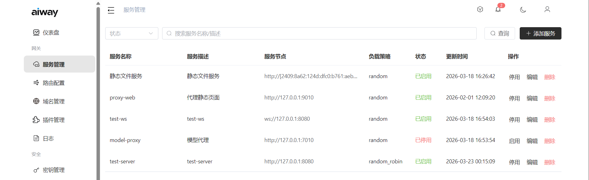

# 负载均衡

网关内置负载均衡模块，负责将请求分发到后端服务实例。

## 策略

目前支持2种策略：
- 随机：随机选择一个服务实例
- 轮询：按顺序选择一个服务实例

默认使用 **随机** 策略。

## 服务实例管理

- 服务可配置多个实例节点（IP:Port）
- 控制台统一管理服务实例列表
- 网关从控制台拉取最新服务配置
- 无可用实例时返回 `502 Bad Gateway`

## 配置

在控制台的服务管理中添加服务实例：

| 配置项 | 说明 |
|--------|------|
| 服务名称 | 服务标识 |
| 实例地址 | IP:Port 列表 |
| 负载策略 | 负载均衡算法 |

## 本地服务

网关内置 LocalService，通过 Unix Socket 处理内部业务：

- 模型代理请求（`/v1/*`）
- MCP 代理请求（`/mcp/*`）
