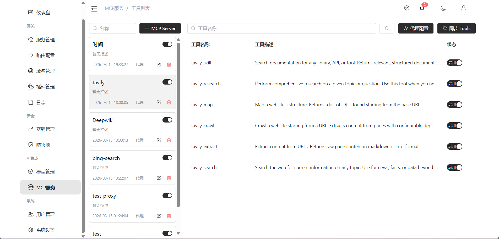

# MCP 集成

MCP (Model Context Protocol) 是一种开放协议，允许 AI 模型安全地访问外部工具和数据源。

## 架构

```
客户端 → 网关 → MCP 服务器
                ├── 文件系统
                ├── 数据库
                ├── API 服务
                └── 自定义工具
```

## 路由规则

请求路径以 `/v1/mcp/` 开头时，网关将其识别为 MCP 代理请求，进入 MCP 调用链。

## 功能

- **工具发现**：自动发现 MCP 服务器提供的工具列表
- **工具调用**：代理客户端调用 MCP 工具
- **连接池**：维护 MCP 服务器的连接池，复用连接
- **会话管理**：独立的会话上下文

## 配置

通过控制台的 MCP 管理页面配置 MCP 服务器信息。

