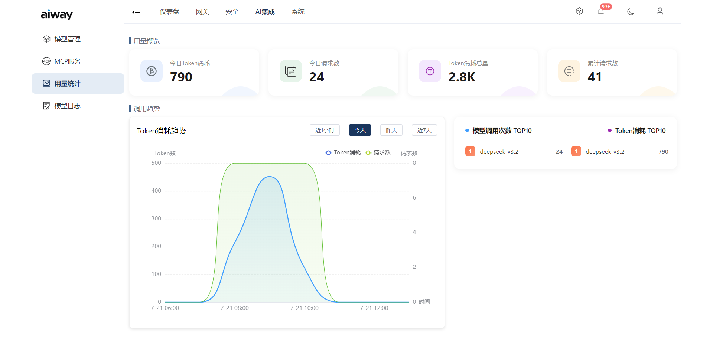

# AI 模型代理

将模型请求转发到不同的模型供应商，使用容OpenAI API兼容格式。

支持模型名称映射，例如：

```text
my-model -> deepseek-v4-flash
         -> qwen3.7-plus
         -> ...
```

可自定义模型名称，并转发到多个提供商处理，支持按随机、轮询、加权随机进行负载均衡，支持服务商接口故障后自动切换。

可自定义模型插件改写请求和响应，实现不同提供商的统一输入和输出处理。

## 架构

```
客户端 → 网关 → 模型供应商 API
                ├── OpenAI
                ├── Anthropic
                ├── 阿里云
                └── 其他模型服务
```

## 路由规则

请求路径以 `/v1/model` 开头时，网关将其识别为模型代理请求，进入模型调用链。

## 模型和供应商配置

通过控制台的模型代理页面配置，支持：

- 供应商列表：添加不同 AI 供应商（OpenAI、Anthropic 等）
- 模型映射：将统一模型名映射到不同供应商的具体模型
- API Key 管理：管理各供应商的认证密钥
- 插件扩展：每个供应商可配置专属的请求转换插件


## 流式响应

支持 SSE 流式响应，实现逐 token 输出。

## 用量统计和日志、

可在“用量统计"和“模型日志”页面中查看模型的调用情况


## 支持的API

### 对话补全

- API: `POST` `/v1/model/completions`

- 参数：详见 OpenAI API 相关文档

### 创建图像

- API: `POST` `/v1/model/images/generations`
- 参数：详见 OpenAI API 相关文档

### 创建语音

- API: `POST` `/v1/model/audio/transcriptions`
- 参数：详见 OpenAI API 相关文档

