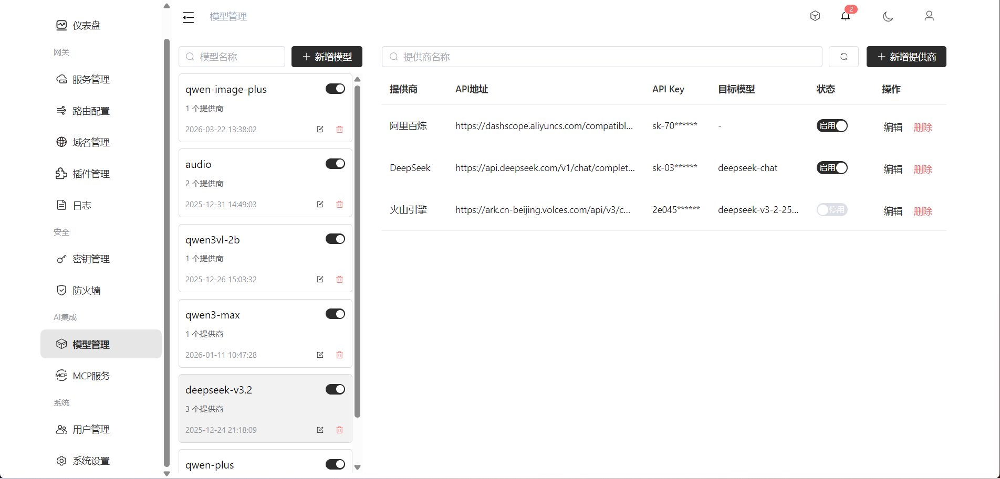

# AI 模型代理

将 AI 模型请求透明转发到不同的模型供应商，兼容OpenAI API规范。

## 架构

```
客户端 → 网关 → 模型供应商 API
                ├── OpenAI
                ├── Anthropic
                ├── 阿里云
                └── 其他模型服务
```

## 路由规则

请求路径以 `/v1/model` 开头时，网关将其识别为模型代理请求，进入模型调用链。

## 供应商配置

通过控制台的模型代理页面配置，支持：

- **供应商列表**：添加不同 AI 供应商（OpenAI、Anthropic 等）
- **模型映射**：将统一模型名映射到不同供应商的具体模型
- **API Key 管理**：管理各供应商的认证密钥
- **插件扩展**：每个供应商可配置专属的请求转换插件



## 流式响应

支持 SSE 流式响应，实现逐 token 输出。
