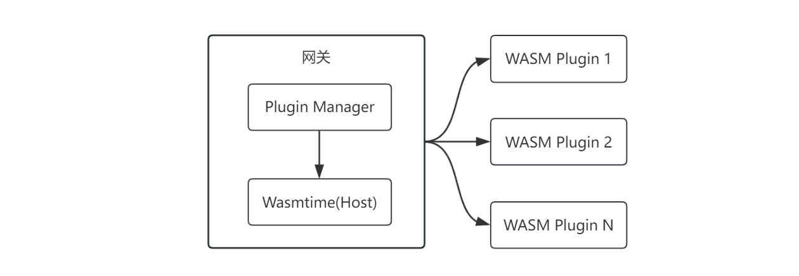

# 插件

插件用于为网关提供扩展能力，基于插件可以实现请求改写、限流、日志收集、请求校验、数据加密等功能。

aiway 插件系统基于 WASM，在沙箱环境中安全执行。

> ⚡ 每次插件调用均需跨越 FFI 边界进行上下文切换，会产生一定的性能损耗。建议在高频请求路径上合理控制插件数量与执行链长度。

## 架构

## 已有插件

我们提供了一些插件实现，可直接下载使用。 插件仓库：[aiway-plugins](https://github.com/xgpxg/aiway-plugins)。

如果这些插件无法满足需求，可参考下一节内容自定义插件。
